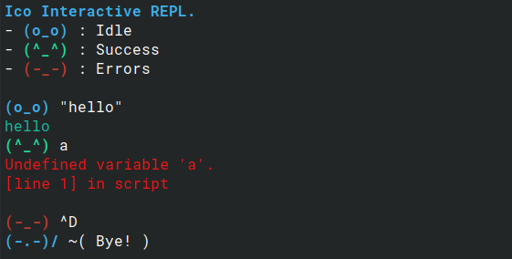

# Ico Language

Ico is a dynamically typed and procedural scripting language where only special characters on a standard keyboard are used for built-in operators and "keywords". It is made mainly for my learning purposes, and although it is a toy language, Ico is a fully working programming language, with an interactive REPL and a script interpreter.

## Bonus

This repository also includes a syntax highlighter VSCode extension in the folder `vscode_extension`, as well as a rough implementation of the language Brainf_ck in Ico in the folder `brainf_ck-ico`.

## Credits & Inspiration

The code is based on the `clox` implementation of the Lox language from the amazing book [Crafting Interpreters](https://craftinginterpreters.com/) by Robert Nystrom. However, Ico is a completely different language with its own syntax and features, as you can see in the sections below.

Some syntax and features of Ico are also inspired by Lua, Python, and Haskell.

## Build

Build prerequisites:
- GCC (preferably version 13 or later)
- [Libedit](https://www.thrysoee.dk/editline/) (Optional for line editting functionality, available in the package manager of most modern Linux distributions)

Build instruction:
- Clone this repository and navigate to it.
- (Optional) Edit the compiling options in the top part of `Makefile`.
- Run `make` and the Ico interpreter should be in the directory `build/ico`.

## Examples

Hello world:
```
>>> "Hello world!";
```

The 10th Fibonacci number:
```
$ fib = /\ n -> n <= 1 ? 1 : \/(n - 1) + \/(n - 2);
>>> fib(10);
```

For more examples, see the __Features__ section below and the folder `ico_codes`.

## Features

### The language

Variable declaration with `$`: `$ a = 5;`

Literals:
```
123         // Int
12.3        // Float
"hello"     // String
:)          // Boolean True
:(          // Boolean False
#           // Null
```

Comment: `// Comments start with // and are all single-line.`

Print:
```
>> "Normal print.";
>>> "Println, aka end with a newline character.";
```

Read from user input:
```
$ s = <<;       // Read a string
$ n = <#;       // Read a number
$ b = <?;       // Read a Boolean
```

Loop:
```
// Only while loop is available
$ i = 0;
@ i < 5 : {
    >> "The current number is: ";
    >>> i;
    i = i + 1;
}
```

Conditional:
```
// If statement
\ 2 > 1 ? {
    >>> "Correct";
}
: { // Else branch (optional)
    >>> "Incorrect";
}

// Can also use just a single statement
\ :) ? >>> "a"; : >>> "b";

// Ternary expression (similar but different from if statement)
$ ternary = 3 < 5 ? "yay" : "nay";
```

List:
```
$ emptyList = [];
$ listWithItems = [1, 2.3, "items can have different types"];
listWithItems[0];        // Single element access
listWithItems[1 -> 2];   // Range access
listWithItems[-1 -> 0];  // Reversed range access with negative index (-1 is the last element)
```

Subscripting strings:
```
$ s = "hello";
>>> s[0];       // Will print "h"
>>> s[-1];      // Will print "o"
>>> s[1->3];    // Will print "ell"
>>> s[4->1];    // Will print "olle"
```

Table (aka hashmap or dictionary):
```
$ map = [#];            // Create an empty table
map["John"] = 12345;    // Set value for a key
>> map["John"];         // Access an entry
map[1] = "hello";       // Any value (except list, table, and null) can be a key
>> map.John;            // String keys can also be used with dot notation
```

Functions:
```
// All functions are defined using lambda expression
$ foo = /\ param1, param2 -> {
    >> "Foo: ";
    >> param1;
    >>> param2;
}

// Short form: the function body can be a single expression
$ double = /\ n -> n * 2;

// Anonymous function recursion: Can refer to the current function with "\/"
$ fib = /\ n -> n <= 1 ? 1 : \/(n - 1) + \/(n - 2);

// Calling anonymous function
>>> (/\ n -> n - 1)(10);    // Will print "9"
```

Built-in functions:
```
clock();        // Return current system time
floor(3.4);     // Return the int floor of a float
len("hello");   // Return the length/size of a string, list, or table
shallowCopy(l);  // Return a shallow copy (element copy) of a list or table
deepCopy(t);     // Return a deep copy (recursive copy) of a list or table
```

For the full list of available syntax, see the file `notes/grammar.md`.

### The REPL

Color-coded prompt based on run result, with expression values printed in cyan:


When compiling with libedit, line editting (such as up arrow to scroll the REPL session history) is available.

### The interpreter

The Ico interpreter is implemented as a bytecode virtual machine. The source code is scanned and compiled to bytecode in memory, then a stack-based virtual machine will execute the bytecode.

Due to being a toy language, Ico has some limitations. For example, the maximum number of calls on the call stack at the same time is 64, or the maximum number of local variables in a local scope is 255.