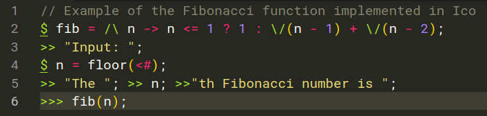
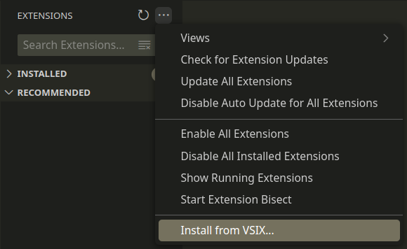

# ico-language-syntax-highlighter

This is a Visual Studio Code extension that provides syntax highlighting support for the Ico programming language.

Example:



## Building and installing

Node.js is required. To build the `.vsix` file:

```bash
cd path/to/ico-language-syntax-highlighter
npm install
npm run build
```

To install the `.vsix` file, open the Extension tab in VSCode and press the 3-dot button, then click "Install from VSIX...":

